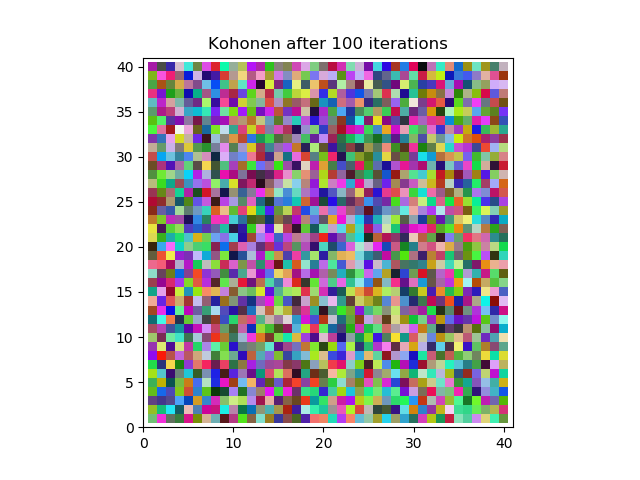
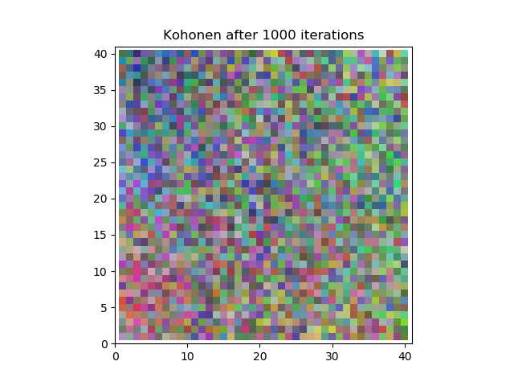
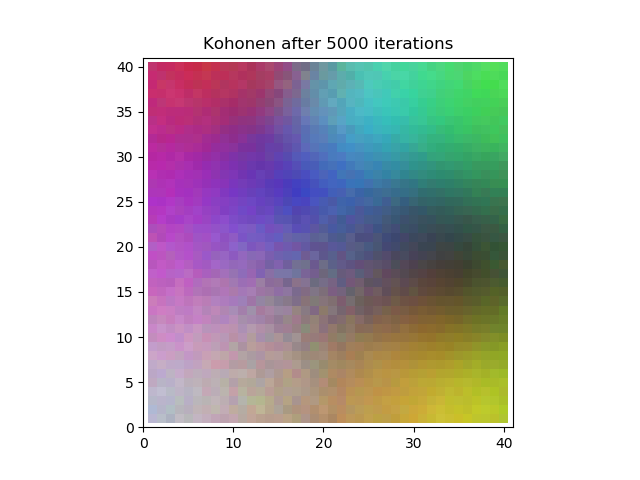
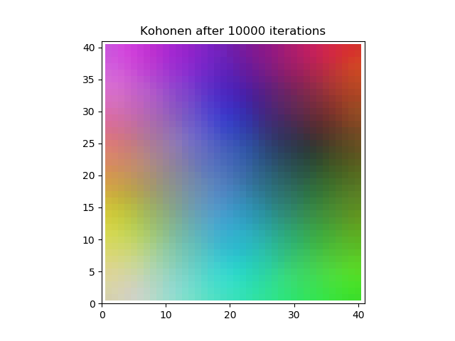

# KohonenColorMapper
Kohonen Color Mapper for Computational Intelligence course @ IUST


# Defenition
Kohonen is a kind of unsupervised neural network (Self Organizing Maps)

# Implementation
`Kohonen.py` has a `Kohonen` class in it which is the implementation of Kohonen network with ability for learning the network.

# Example
a color mapper to 2D space is implemented in `main.py` . you can run this example with command below:
```
python main.py main.py [-h] [-n ITERATIONS] [-c COLORS]  [-s SAVE] [-l LEARNRATE] [-x XDIM] [-y YDIM]
```

+ -h : help for runnig the example
+ -n : number of iterations for learning phase
+ -c : number of colors generated (XDIM * YDIM should be equel to this parameter)
+ -s : boolean flag for saving the final picture of the network
+ -l : learning rate for the network
+ -x : first dimension for the network
+ -y : second dimension for the network

# Pictures





